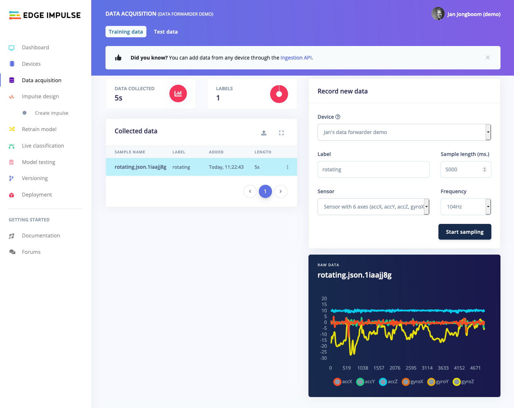

# Data Forwarder example (Zephyr)

An example firmware for the Nordic Semiconductor nRF52840 DK showing how to use the [Edge Impulse Data Forwarder](https://docs.edgeimpulse.com/docs/cli-data-forwarder) to capture data from an IMU sensor at 104Hz and send it to Edge Impulse. This application should be easily adaptable to other Zephyr-supported development boards or sensors.

## How to build

1. Install the [Edge Impulse CLI](https://docs.edgeimpulse.com/docs/cli-installation).
1. Install and configure your Zephyr toolchain. This also works with the [nRF Connect SDK](https://www.nordicsemi.com/Software-and-tools/Software/nRF-Connect-SDK).  
| Note: Currently supported NCS version is 1.9.1
1. Clone this repository:

    ```
    $ git clone https://github.com/edgeimpulse/example-dataforwarder-zephyr
    ```

1. Build and flash this application:

    ```
    $ cd example-dataforwarder-zephyr
    $ west build -b nrf52840dk_nrf52840
    $ west flash
    ```

1. Run the data forwarder (use `--clean` to set a new project):

    ```
    $ edge-impulse-data-forwarder
    ```

1. Your device is now connected in Edge Impulse, and you can sample data!

    
